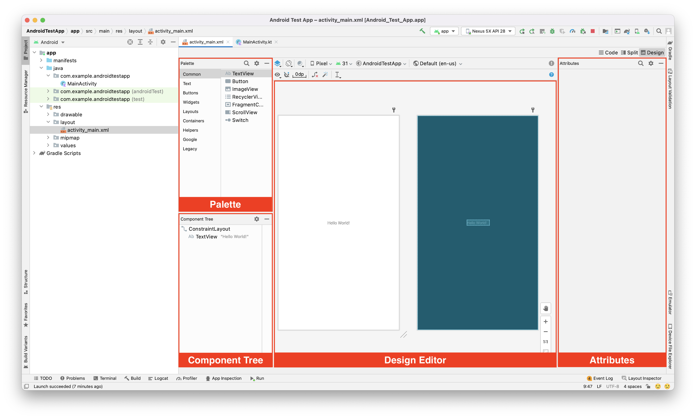
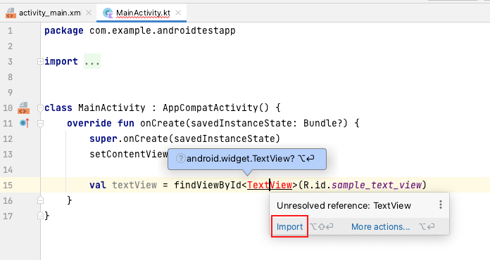

# はじめに

## 今回の目的
以下の開発ツール・言語を用いてAndroidアプリを作成してみる。  

### 開発ツール
* Android Studio 4.1.1  
Andoird端末で動作するアプリケーションを開発するために用意された公式の統合開発環境（IDE）。  
IntelliJ IDEAがベースになっている。Android Studio 3.0より公式にKotlinが同梱。  
最新バージョンは4.1.1。 

### 使用言語
* Kotlin  
2011年7月20日に発表された静的型付けのオブジェクト指向プログラミング言語。  
Java言語をもっと簡潔・安全になるように改良した産業利用向け汎用言語として開発された。  
オペレーティング・システムによらずJava仮想マシン(JVM)上で動く。  

# プロジェクトの作成

#### 1. Android Studioをインストールしてアプリケーションを起動する

#### 2. 起動パネルから「**Start a new Android Studio project**」を選択する


起動パネルが表示されていない場合は、上部メニューから「File → New → New Project...」を選択する  

  


#### 3. Select a Project Templateの設定  

これから作成するアプリのテンプレートを指定します。  
今回は「**Empty Activity**」を選択し、Nextを押下します。  


#### 4. Configure your Projectの設定

今回は下記のように設定します。  

  

※Minimum API level・・・  
これから作るアプリが対応する最小のAPIレベルを指定します。  
設定する最小APIレベルにより、非対応なメソッドやプロパティが存在するので要注意。
（プロジェクト作成後でも変更できます）  

設定ができたらFinishを押下し、プロジェクトを作成します。  

# アプリのビルドと実行

早速ですが、まずは作成したプロジェクトを実際に動かしてみましょう。PC上でエミュレータを使用、もしくはAndroid端末をPCに接続し端末側でデバッグを許可することで、簡単に作成中のアプリの動作を確認することができます。  
ここではエミュレータを使用してアプリをビルド・実行する方法をご紹介します。  

まず、以下の赤枠に注目してください。  


ここに「**No devices**」と表示されている場合は今起動できるエミュレータが存在しないことを示しており、エミュレータを作成して追加する必要があります。  
「**No devices**」をクリックし、プルダウン内の「**AVD Manager**」をクリックします。  


Android Virtual Device Managerが開かれるので、「**＋ Create Virtual Device...**」をクリックしてエミュレータを作成しましょう。  


次の画面では作成するエミュレータのデバイスの種類を指定します。  
今回は「**Phone**」の「**Nexus 5X**」を選択して、Nextを押下します。  


次に、エミュレータのバージョンを指定します。  
今回は「**Pie**」を選択して、Nextを押下します。  


ここでPieの横に「Download」と表示されている場合はそのエミュレータをダウンロードする必要があるため、Downloadを押下します。  
ダウンロードが完了したらNextを押下します。  

次の画面ではエミュレータの名前や向きを設定出来ますが、今回はデフォルトのままで大丈夫ですので、Finishを押下し、エミュレータを作成・追加します。Android Virtual Device Managerにエミュレータが追加されたことを確認しましょう。  

確認できたら先ほどの「No devices」がエミュレータ名に変わっているはずなので、隣の**▶︎(Run)ボタン**を押下することでそのエミュレーターが別ウィンドウで起動し、自動的にアプリが立ち上がります。  


以下のように表示されたでしょうか？  


## Activityの初期表示

ここではまずプロジェクト作成時に同時に生成されたMainActivityを用いて、画面表示の基本的な所をおさえていきます。  

まず、MainActivityのclass内にはあらかじめ以下のメソッドが記述されているはずです。  

```kotlin
override fun onCreate(savedInstanceState: Bundle?) {
    super.onCreate(savedInstanceState)
    setContentView(R.layout.activity_main)
}
```

MainActivityが開かれていない場合は、左のファイル一覧から選択して開いてください。  


Activityにはライフサイクルがあり、以下のように生成から破棄までの一連の流れに応じたコールバックメソッドが呼ばれます。  

  

onCreate内で setContentView メソッドを呼ぶことで、レイアウトリソースをActivityにセットしています。画面表示時に配置するUIパーツはこのようにしてAcitivityで読み込みます。  

今度はそのレイアウトリソースを見てみましょう。  


## レイアウトリソースの形式 
画面のレイアウトを決めるリソースファイルは基本的にxmlファイルで作成します。  
実際にxmlファイルに記述することでレイアウトを作成することもできますが、今回はより直感的にレイアウトを編集でき、視覚的にもわかりやすいLayout Editorで作成していきます。  

左のファイル一覧からactivuty_main.xmlを開いてください。下のようなLayout Editorが表示されます。  



- **Palette**
  ここからレイアウトに追加する要素を選択します。  
- **Component Tree**
  現在配置されている要素や要素の階層の確認・編集が可能です。  
- **Design Editor**
  実際のレイアウトが表示され、ここでも配置されている要素の確認・編集ができます。  
- **Attributes**
  BやCで要素を選択した際に、その要素の属性が一覧で表示され、ここで要素に表示する文字や要素の背景、サイズ等の細かな設定を行うことができます。  
  またID属性を設定することにより、その要素をソースコード側が参照できるようになります（そうするとソースコード側から要素の設定ができるようになります）。  


## レイアウトを構成する要素  

画面を構成する要素は大まかに**Widget**と**Layout**の二種類あります。  

- **Widget**
  テキストラベルやボタン、入力フィールドなど、各UI部品を指します。  
  Widgetは後述のLayout内にしか配置できません。  

    

- **Layout**
  WidgetやLayoutを配置するための枠を指します。  
  Layoutの種類により、各Widgetの配置方法が異なります。  
  Layoutの中にはWidgetおよび子Layoutを入れることができます。  


## Layoutの種類  
Layoutの種類はいくつかあり、レイアウト方法により使い分けたり、入れ子にして使ったりします。  

* FrameLayout   

  

最もシンプルなレイアウトで、要素を左上に配置します。複数要素を子要素とした場合、重なって表示されます。  

* LinearLayout   

  

基本と言ってもいいレイアウトで、中に入れた要素を並列に配置します（FrameLayoutとは違い要素は重なりません）。縦横どちらかに並べることができます。  

* TableLayout / GridLayout   

  

要素を格子状に並べることができます。TableLayoutは列を、GridLayoutは列・行をまたいで配置することができます。電卓のようなUIを作りたい時便利です。  

* RelativeLayout  
相対レイアウトです。基準となる要素を指定し、その要素に対して相対的に配置します。  
  
* ConstraintLayout  
制約を付加することにより要素を配置します。RelativeLayoutに似ていますが、要素は自分で設定せず、自身に対して一番近いものからの相対配置となります。  


## 実際にレイアウトしてみる  

それでは実際に画面のレイアウトを組んでいきましょう。  
今回のアプリでは、要素の階層の一番上にデフォルトで配置されている**ConstraintLayout**でレイアウトを組んでいきます。  

ConstraintLayoutは制約を用いて要素を配置していくLayoutでしたが、では実際にはどのような形で制約をつけるのでしょうか。  
デフォルトで配置されているTextViewをクリックして選択した状態で、右側の**Attributes**を見てみてください。  
以下のような情報が見られると思いますが、これが今まさにこのTextViewに付けられている制約の情報です。  


- １・・・**Margin**（制約の距離（単位はdp））
- ２・・・**Bias**（位置の移動（単位は%））
- ３・・・要素の縦/横の長さの決定方法の変更（クリックする度に以下の順で切り替わります）
  　　　　**Wrap Content**（文字列等の要素内の情報に対して適切な長さになります）
  　　　　**Fixed**（現在表示されている長さに固定します）
  　　　　**Match Constraint**（他の制約に従って長さを決定します）
- ４・・・**Delete Constraint**（制約の削除）
- ５・・・上記の上下左右の制約がどのLayout/Widgetに対して付けられているか
  　　　　※Start = 左端、End = 右端、Top = 上端、Bottom = 下端
  　　　　  例えば『Start → StartOf **parent** (0dp)』は、
  　　　　  『（TextViewの）Startがparent（親Layout）のStartから0dp離れた位置に付く』
  　　　　  という意味になります。

実際に１〜４の値を弄ってみると直感的に理解しやすいと思います。  
試しにTextViewを以下のような配置に変更してみましょう。  


制約は以下のようになります。Bottomの制約を削除するのがポイントです。  


次にボタンを配置してみましょう。  
左上のPaletteからその下のComponent Treeまで**Button**をドラッグ&ドロップし、TextViewの下に配置します。  


配置されたばかりのButtonにはまだ制約が付いておらず、Component Treeに赤いエラーマークが出てしまっているので、Buttonに新しく制約を付与しましょう。  
以下のような配置を目指します。  


まずはTextViewとの間が32dpという制約をつけてみます。  
Buttonを選択状態にすると中央のDesign Editor上のButtonの上下左右に丸いCreate Constraintマークが表示されるので、ButtonのTopのマークをドラッグしてTextViewのBottomのマークに繋げてみましょう。  
Buttonが移動して、0dpとして制約が付与されます。  


あとは先ほどと同様に右のAttributesから数値を32に変更します。  

次に、TextViewと中心を合わせます。  
Buttonの左右それぞれのConstraintを、TextViewの同じく左右それぞれに繋げてみましょう（距離は0dpのままで大丈夫です）。  
そうすると、自然とTextViewの中心に合うようになります。  
以下の画像のようになったでしょうか？  


この様に、Constraint Layoutでは要素と要素の間に様々な制約を付与することによって、柔軟なレイアウトが可能となっています。  


# UIとプログラムの紐付け

## レイアウトリソースの参照

ここでは、先程配置したレイアウトをプログラム側から操作する方法を示します。  
まず、先程配置したTextViewとButtonのID属性に以下を付与します。  
ID属性もAttributesから編集が可能です。  

   

* TextView -> `sample_text_view`
* Button -> `sample_button`

これらの要素をプログラム上から参照するために、その要素を含むレイアウトリソースを読み込んだクラス（今回はMainActivity）のonCreateメソッド内で、setContentView(R.layout.activity_main)の後に  

```kotlin
    val textView = findViewById<TextView>(R.id.sample_text_view)
```

と記述してみましょう。  

※記述した際に以下のようなエラーが出る場合、macのoptionキーを押しながらEnterキーを押すことで必要なソースがインポートされ、エラーは無くなります。  



次に、LogCat（Android Studio下部で表示するコンソール部分）でtextViewのtextを出力してみましょう。  
LogCatに出力するには`println()`と記述し、括弧内には出力したい文字列を入力します。  

また、textViewのテキストは`textView.text`で取得できます。  

`textView.text`内の文字列が出力できたら、次に`textView.text`の文字列を編集してみましょう。  
先ほど書いた`println()`の次の行に、  
```kotlin
textView.text = "任意の文字列"
```
と記述します。  
こうすることで、`textView.text`の文字列を任意の文字列で上書きすることができます。  
次の行でもう一度`println()`と書き、文字列が上書きされていることを確かめてみましょう。  

-------------

**さて、今度はsetContentView(R.layout.activity_main)の手前でtextViewのtextをprintlnしてみましょう。**  

無事、アプリがクラッシュしたことと思います。これはつまり、setContentView(R.layout.activity_main)によってレイアウトをセットしているので、それよりも前に参照しようとすると参照すべき要素が見つからずNull Pointer Exceptionとなってしまいます。  


## ListenerおよびHandlerの実装

さて、TextViewを参照・編集できることはわかりました。  
今度はButtonが押されたときに、textViewに現在時刻が表示されるようにしましょう。  
activity_main.xmlを開いてください。  

Buttonを選択した状態でCommon Attributesの**onClick**を編集します。  
この属性にメソッド名を記述すると、Buttonがクリックされた際にそのメソッドが実行されるようになります。  
また、こういった何らかのイベントに応じて呼ばれるメソッドを**Listener**と言います。  
今回はonClickSampleButtonと入力します。  

   

ここでButtonに赤色のエラーが現れますが、これは指定のメソッドが見つからないというエラーなので、今度はそのメソッドを作成します。  
MainActivity.ktを開いて、`onCreate(savedInstanceState: Bundle?)`メソッドの下に、以下のように記述してください。  
`println()`の中の文字列はなんでも構いませんが、文字列として扱うためにダブルクォーテーションで括る必要があります。  

```kotlin
    fun onClickSampleButton(view: View) {
        println("出力")
    }
```

ここまで記述できたら一度Runして、動作を確認してみましょう。  
LogCatに`println()`内の文字列が出力されていれば成功です。  

また、**Listener**の実際の処理内容を**Handler**と言います。  
**Listener**がイベントの通知を受け取り、その際の処理を**Handler**が受け持ちます。  
今回の場合は、**onClickSampleButton**というListenerのHandlerが**println("出力")**ということになります。  


## 課題  
Buttonが押されるたびに、TextViewに現在時刻が表示されるようにしましょう。  
現在時刻は`Date().toString()`で文字列として取得することができます。  
※Dateのimport候補が2種類出てきた場合は、`java.util.Date`を選択してください。  
    
