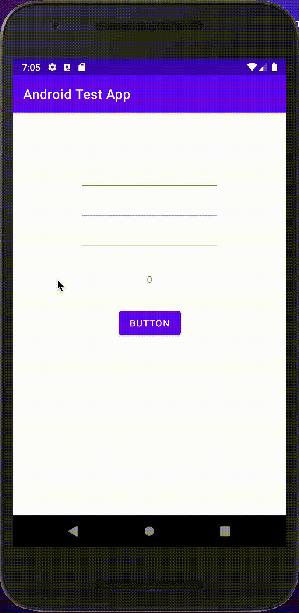
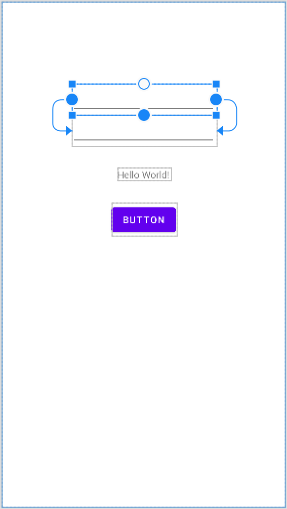
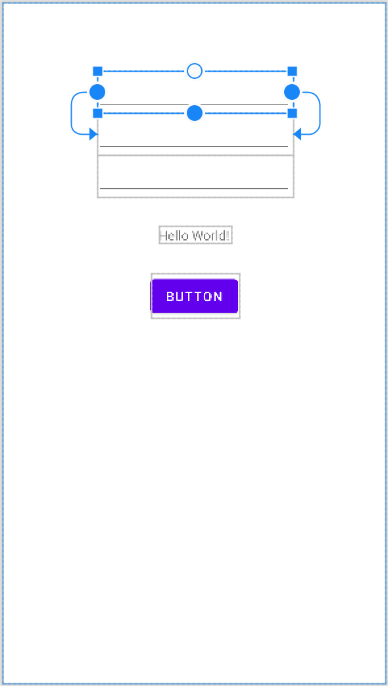
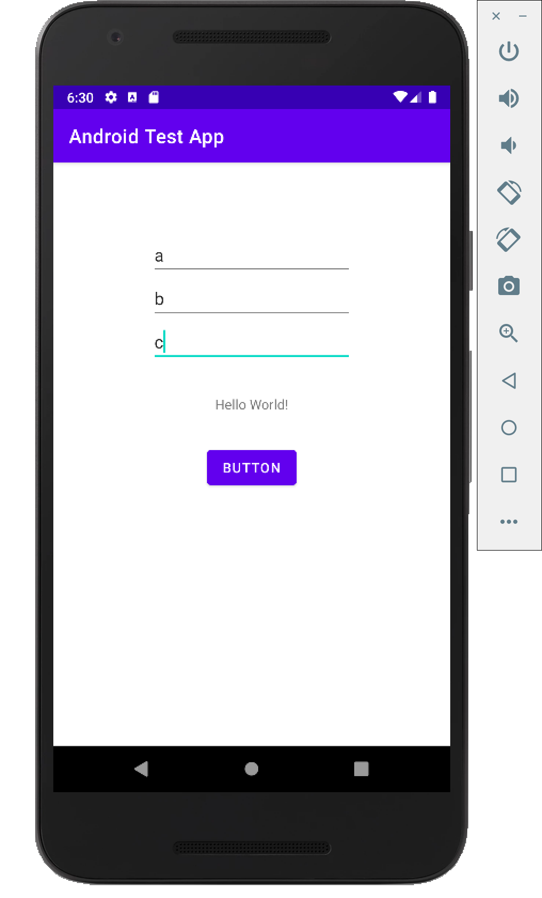
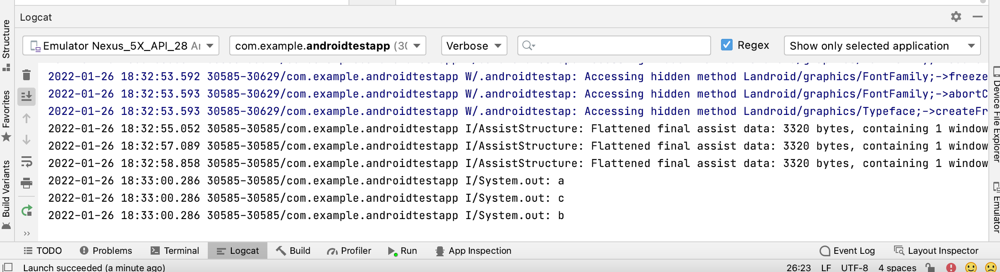

# 計算機アプリの作成

## 今回の目的  
以下のような、簡易的な計算機アプリを作成する。  


#### 1. EditTextを配置し、コードに紐づける

まずは、演算子と第二項を入力するためのEditTextを3つに増やします。Attributesから、それぞれのEditTextのID属性をわかりやすい値に変更しましょう。初期値の「Name」も不要なので削除しましょう。  
* 上 -> `number1_edit_text`
* 中 -> `operator_edit_text`
* 下 -> `number2_edit_text`



また、計算機アプリなので、TextViewの初期値を「Hello World!」から「0」に変更しておきましょう。  

#### 2. 処理の記述

ボタンを押した際の処理を、テキストボックスの入力値を元に四則演算を行う処理に書き換えていきます。  
まず、それぞれのテキストボックスの入力値を取得してみましょう。  
ラベルの書き換えでは、EditTextの値を画面に表示しましたが、Android Studio上から値を参照することもできます。  
以下の様に記述してください。  

```kotlin
fun onClickSampleButton(view: View) {
    val number1EditText = findViewById<EditText>(R.id.number1_edit_text)
    val number2EditText = findViewById<EditText>(R.id.number2_edit_text)
    val operatorEditText = findViewById<EditText>(R.id.operator_edit_text)

    val text = number1EditText.text
    val text2 = number2EditText.text
    val text3 = operatorEditText.text

    println(text)
    println(text2)
    println(text3)
}
```

`println(値)`と記述することで、値をLogCat（Android Studio下部で表示するコンソール部分）に出力することができます。  
この状態で実行し、3つのテキストボックスに値を入力してからボタンを押すと、以下の様にLogCatに文字が表示されます。    




次に取得した値を使って計算を行いますが、このままでは計算を行うことができません。  
というのも、kotlinには**データ型**という概念があり、それぞれの値がどういった種類のデータなのかが厳格に区別されているからです。  

EditTextの値は編集可能な文字列を表す**Editable型**という種類のデータで、計算を行う為には整数を表す**Int型**に変換する必要があります。Editable型は直接Int型に変換することができないため、一般的な文字列を表す**String型**を経由して**Editable型 → String型 → Int型**と言うように変換します。  

まずはEditable型 → String型の変換処理です。
```kotlin
fun onClickSampleButton(view: View) {
    val number1EditText = findViewById<EditText>(R.id.number1_edit_text)
    val number2EditText = findViewById<EditText>(R.id.number2_edit_text)
    val operatorEditText = findViewById<EditText>(R.id.operator_edit_text)

    val text = number1EditText.text.toString()
    val text2 = number2EditText.text.toString()
    val text3 = operatorEditText.text.toString()
    println(text)
    println(text2)
    println(text3)
}
```

(Editable型).toString()を用いることで変換することができます。  

次にString型 → Int型の変換処理です。  

```kotlin
fun onClickSampleButton(view: View) {
    val number1EditText = findViewById<EditText>(R.id.number1_edit_text)
    val number2EditText = findViewById<EditText>(R.id.number2_edit_text)
    val operatorEditText = findViewById<EditText>(R.id.operator_edit_text)

    val num1 = number1EditText.text.toString().toIntOrNull() ?: 0
    val num2 = number2EditText.text.toString().toIntOrNull() ?: 0
    val op = operatorEditText.text.toString()
    println(num1)
    println(num2)
    println(op)
}
```

(String型).toInt()を用いることで変換することができますが、注意しなければならないことがあります。  
String型 → Int型の変換処理では、1という文字を1という数値に変換することはできても、aという文字に対応する数値がないため、値をうまく変換することができないことがあり、この処理のままだとアプリがクラッシュします。   
そのため、toInt()の代わりにtoIntOrNull()を用いましょう。toIntOrNull()では、Int型に変換変換できなかった場合に、**null**と言う値になります。nullとは何もないことを表す値です。  toIntOrNull()を用いると、**Int型もしくは、null**と言うことを表す**Int?型**に変換されます。  
Int?型 → Int型は`Int?型の値 ?: nullだった場合の代替値`とすることで変換できます。  

ここまでできると、四則演算が可能となります。  
例えば足し算は以下のようにします。  

```kotlin
fun onClickSampleButton(view: View) {
    val number1EditText = findViewById<EditText>(R.id.number1_edit_text)
    val number2EditText = findViewById<EditText>(R.id.number2_edit_text)
    val operatorEditText = findViewById<EditText>(R.id.operator_edit_text)

    val num1 = number1EditText.text.toString().toIntOrNull() ?: 0
    val num2 = number2EditText.text.toString().toIntOrNull() ?: 0
    val op = operatorEditText.text.toString()
    println(num1 + num2)
}
```

その他の演算は以下の通りです。  

| 演算子 | 演算 |
| :-: | :-- |
| - | 引き算 |
| * | 掛け算 |
| / | 割り算(商のみ) |

四則演算ができたので、残るは演算子の判定のみです。  
editText2.textに演算子が入力されるとして、この値によって行う演算を変化させる処理を記述します。  
以下のようにプログラムを変更してください。  

```kotlin
fun onClickSampleButton(view: View) {
    val textView = findViewById<TextView>(R.id.sample_text_view)
    val number1EditText = findViewById<EditText>(R.id.number1_edit_text)
    val number2EditText = findViewById<EditText>(R.id.number2_edit_text)
    val operatorEditText = findViewById<EditText>(R.id.operator_edit_text)

    val num1 = number1EditText.text.toString().toIntOrNull() ?: 0
    val num2 = number2EditText.text.toString().toIntOrNull() ?: 0
    val op = operatorEditText.text.toString()
    
    when (op) {
        "+" -> textView.text = (num1 + num2).toString()
        "-" -> textView.text = (num1 - num2).toString()
        "*" -> textView.text = (num1 * num2).toString()
        "/" -> textView.text = (num1 / num2).toString()
        else -> textView.text = "エラー"
    }
}
```

これは**when**と呼ばれる構文で、 *when()* 内に指定した値が`場合 -> 処理`で列挙した場合の値に一致した時に処理を実行します。  
処理については{}で囲うことで複数行記述でき、以下のように変数定義もできます。  

```kotlin
~ 省略 ~

"+" -> {
  val result = num1 + num2
  textView.text = result.toString()
}

~ 省略 ~
```

また、同じ処理を以下のように記述することもできます。  

```kotlin
fun onClickSampleButton(view: View) {
    val textView = findViewById<TextView>(R.id.sample_text_view)
    val number1EditText = findViewById<EditText>(R.id.number1_edit_text)
    val number2EditText = findViewById<EditText>(R.id.number2_edit_text)
    val operatorEditText = findViewById<EditText>(R.id.operator_edit_text)

    val num1 = number1EditText.text.toString().toIntOrNull() ?: 0
    val num2 = number2EditText.text.toString().toIntOrNull() ?: 0
    val op = operatorEditText.text.toString()
    
    if (op == "+") { // opと+が同一の値かどうか比較を行なっている
        textView.text = (num1 + num2).toString()
    } else if (op == "-") {
        textView.text = (num1 - num2).toString()
    } else if (op == "*") {
        textView.text = (num1 * num2).toString()
    } else if (op == "/") {
        textView.text = (num1 / num2).toString()
    } else {
        textView.text = "エラー"
    }
}
```

こちらは**if文**と呼ばれる構文で、最初は *if()* 、それ以降は *else if()* に値の値の比較などの実行条件を記述することで、その条件が真の場合に *{}* で囲まれた部分の処理を行います。  
 *else* はif, else ifのどの条件にも該当しない場合に実行されます。  
今回は *==(等号)* を使って値を比較しましたが、他には以下のような比較があります。  

| 演算子 | 演算 |
| :-: | :-- |
| a != b | aとbは等しくない |
| a > b | aはbより大きい |
| a >= b | aはb以上 |
| a < b | aはbより小さい |
| a <= b | aは以下 |

## 課題1

ここまでで作った計算機アプリでは、割り算を行なった際に、3つ目のテキストボックスの値が0になるとアプリが停止してしまいます。  
これを解決する為に3つ目のテキストボックスの値を判定し、0の場合はラベルにエラーを表示するように修正を行なってください。  

[解答](./answer/02-1.md)  

## 関数

ここまでで、onClickSampleButton内のコードがかなり長くなってしまったと思います。  
プログラミングではこうしたコードを分割して、名前をつけて処理を小分けにする**関数定義**という機能が存在します。  
小分けにした処理は別の部分からも実行可能であり、処理の再利用が可能となります。  
関数にはインプット(**引数**)とアウトプット(**戻り値**)が存在し、  
処理を実行する前にパラメータとして引数を渡し、処理の結果を戻り値として受け取ることが可能です。  
ここでは関数定義の例として、onClickSampleButtonの処理中から、受け取った文字列に応じた演算を行う処理を関数に切り出してみます。  
以下のようにコードを修正してください。  

```kotlin
// 省略

fun onClickSampleButton(view: View) {
    val textView = findViewById<TextView>(R.id.sample_text_view)
    val number1EditText = findViewById<EditText>(R.id.number1_edit_text)
    val number2EditText = findViewById<EditText>(R.id.number2_edit_text)
    val operatorEditText = findViewById<EditText>(R.id.operator_edit_text)

    val num1 = number1EditText.text.toString().toIntOrNull() ?: 0
    val num2 = number2EditText.text.toString().toIntOrNull() ?: 0
    val op = operatorEditText.text.toString()

    textView.text = this.calculate(num1, num2, op)
}

fun calculate(num1: Int,  num2: Int, op: String) :String {
    when (op) {
        "+" -> return (num1 + num2).toString()
        "-" -> return (num1 - num2).toString()
        "*" -> return (num1 * num2).toString()
        "/" -> return (num1 / num2).toString()
        else -> return "エラー"
    }
}

// 省略
```

kotlinの関数は`fun 関数名(引数列挙) :戻り値の型 {}`としてコード中に記述し、{}内に処理を記述します。  
戻り値は`return 戻り値`と記述し、呼び出し元ではそれを変数などに代入することによって後続の処理に使用することができます。  
これで、処理を切り出すことができ、onClickSampleButton内の処理もスリムにすることができました。  
しかし、関数calculateの再利用性を考えた場合、引数が文字列だと使い勝手が悪いかもしれません。(calculateの値を使って別の計算を行う場合など)  
そこで、戻り値の値を整数値にしてみましょう。ただし、失敗した場合も考え、戻り値はInt?型とします。  

```kotlin
// 省略

fun onClickSampleButton(view: View) {
    val textView = findViewById<TextView>(R.id.sample_text_view)
    val number1EditText = findViewById<EditText>(R.id.number1_edit_text)
    val number2EditText = findViewById<EditText>(R.id.number2_edit_text)
    val operatorEditText = findViewById<EditText>(R.id.operator_edit_text)

    val num1 = number1EditText.text.toString().toIntOrNull() ?: 0
    val num2 = number2EditText.text.toString().toIntOrNull() ?: 0
    val op = operatorEditText.text.toString()

    textView.txt = this.calculate(num1, num2, op).toString()
}
fun calculate(num1: Int,  num2: Int, op: String) :Int? {
    when (op) {
        "+" -> return num1 + num2
        "-" -> return num1 - num2
        "*" -> return num1 * num2
        "/" -> return num1 / num2
        else -> return null
    }
}

// 省略
```

関数の戻り値を変更したため、textView.textの代入部分も、`toString()`を使って文字列に変換するようにしています。  

しかし、ここで一つ問題が出てきます。  

先程までの例では、演算子に不正な値が入ってきた場合は、"エラー"という文字を出力していましたが、  
今回の変更で、nullまで文字列に変換されてしまうようになったと思います。  

関数呼び出しでnullが返却された場合は、"エラー"と表示するため、  
Kotlinでは、 **オプショナル・チェーン** という機能が利用できます。  

オプショナル・チェーンは、nullとなり得る値に?をつけることで、  
値がnullだった場合、後続の処理は行わず、そのままnullを返す機能の事で、  
calculate(num1, num2, op)のあとに **?** をつけることで、関数の戻り値がnullだった場合、  
`toString()`は行われず、nullが返るようになります。  

あとは、`?:`と組み合わせることで、以下ように修正することができます。  

```kotlin
// 省略

// calculate(num1, num2, op)のあとに'?'をつける
textView.text = calculate(num1, num2, op)?.toString() ?: "エラー"

// 省略
```

## 繰り返し処理

ここでもう一つ重要な構文について触れておきましょう。  
ある処理を複数回繰り返す際に用いるfor文です。  
以下のようにコードを編集し、実行しててください。  

```kotlin
fun onClickSampleButton(view: View) {
    val number1EditText = findViewById<EditText>(R.id.number1_edit_text)
    val number2EditText = findViewById<EditText>(R.id.number2_edit_text)
    val num1 = number1EditText.text.toString().toIntOrNull() ?: 0
    val num2 = number2EditText.text.toString().toIntOrNull() ?: 0
    
    for (i in 0..num2) {
        println("${i}: ${num1}") // "${変数名}"で変数を文字列中に埋め込むことができる
    }
}
```

動作を確認してみると、ボタンを押した際に2つ目のテキストボックスに入力した回数分1つ目のテキストボックスに入力した値がデバッグエリアに表示されます。  
改めてコードを確認してみると、`for (i in 1..num2)`の部分は1からnum2までの数値を順番にiという変数に代入するという意味で、  
{}で囲われた部分は変数iに値が代入されるたびに実行される処理を表しています。   
  
この構文を利用して、以下の課題に取り組んでみてください。  

## 課題2

ここまでで作った計算機アプリに累乗を求める機能を追加してください。  
演算子に"^"が入力された場合に、1つ目のテキストボックスの数値を2つ目のテキストボックスに入力された数値分かけた値をラベルに表示します。  
  
ヒント:  
計算途中の値を保持しておく必要があるため、変数を利用しますが、一度値を設定した変数に別の値を設定したい場合、  
`val 変数名`で変数定義を行うのではなく、`var 変数名`として変数を定義します。  

[解答](./answer/02-2.md)  