# iOSアプリ開発・プログラミングの基礎

## iOSアプリ開発

iOSアプリの開発ではMacで利用可能なIDE(統合開発環境)[^1]の**Xcode**を使用します。  
また、使用するプログラミング言語は**Swift**とObjective-Cのいずれかを選択できますが、現在はSwiftが主流となっています。  
(2022年1月時点でXcodeはVersion 13.2、SwiftはSwift5が最新版となっています。)  

実際にXcodeでアプリを作ってみましょう。  

## 新規プロジェクトの作成

#### 1. Xcodeを起動すると次のような画面が開きます。

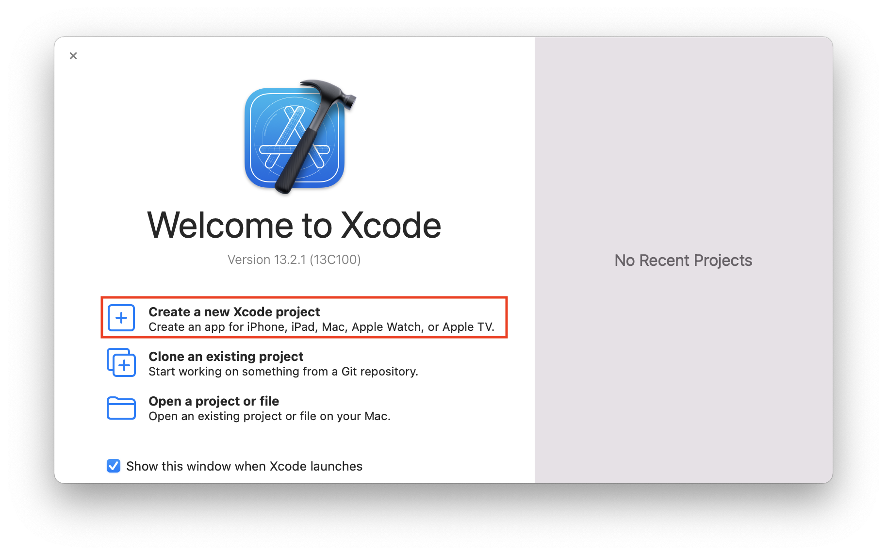

#### 2. "Create a new Xcode project"を選択すると、プロジェクトのテンプレートを選択する画面が表示されます。

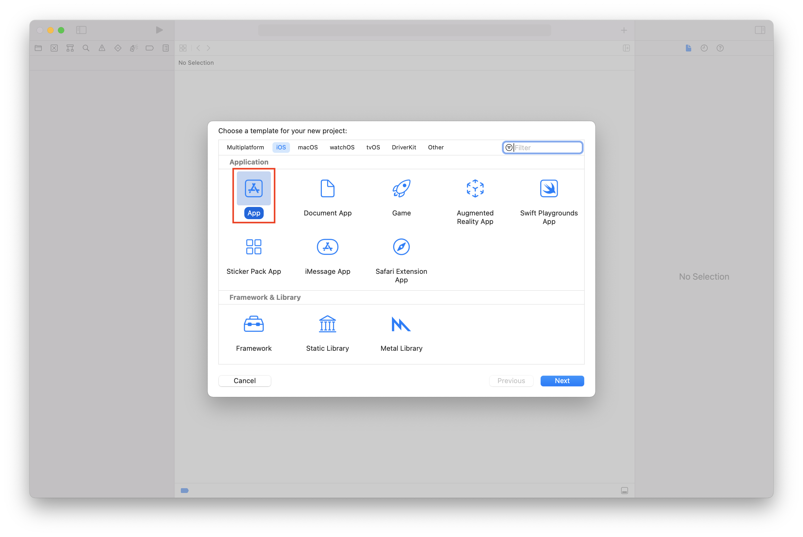

いくつかのテンプレートが用意されていますが、ここではもっとも基本的な"App"を選択します。  

#### 3. テンプレートを選択し、"Next"を押すとプロジェクトの名前などを設定する画面が表示されます。

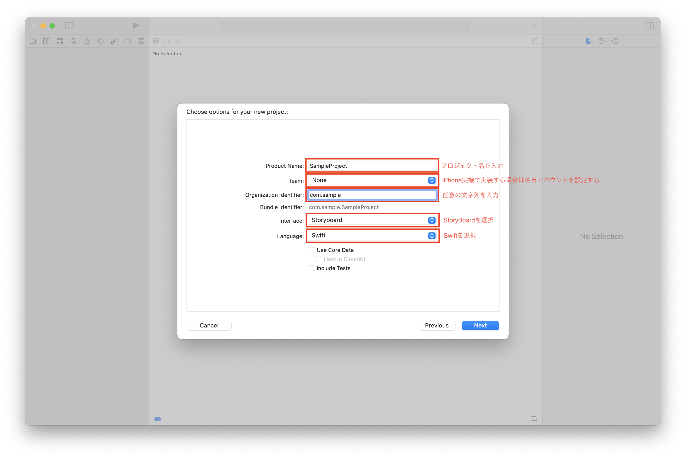

※ Xcode 11から、ボタンの配置などUI(User Interface)の作成に**Storyboard**と**Swift UI**のいずれかが選択可能となりました。  
今回の研修ではStoryboardを使って開発を行なっていきたいと思います。  

入力を終えて"Next"を押すと、プロジェクトの保存場所を選択になりますが、特にこだわりがない場合はデフォルトで選択されている場所に保存して構いません。  
保存場所決定すると、iOSアプリのプロジェクトが作成されます。  

## Xcodeの各画面の説明

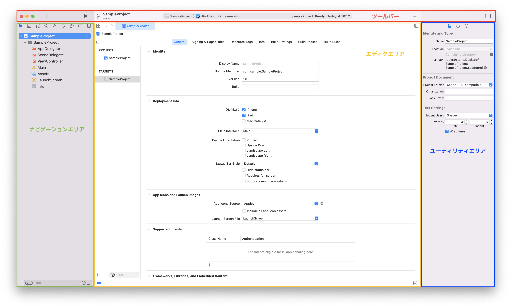


#### 1. ツールバー
アプリの起動・停止などの操作を行うボタンなどが存在するエリアです。  

#### 2. ナビゲーションエリア
プロジェクト(アプリ)を構成するフォルダやファイルの一覧を表示するエリアです。  

#### 3. エディタエリア
ファイルを編集するエリアです。  

#### 4. ユーティリティエリア
ファイルのプロパティなどを設定するエリアです。  

## アプリの起動

プロジェクトを作成した時点でiOSアプリをMac上で起動することができます。  
ツールバーの"▶︎"を押してアプリを起動してみましょう。真っ白な画面が出てきたら成功です。  
※シュミレータがインストールされていない場合は、インストールしてから起動する必要があります。  

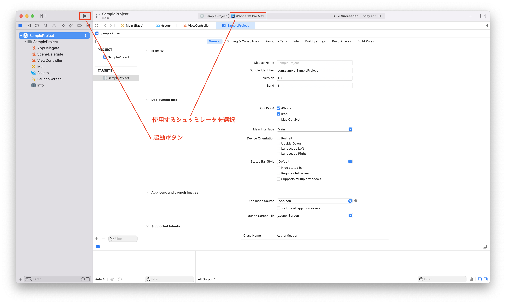
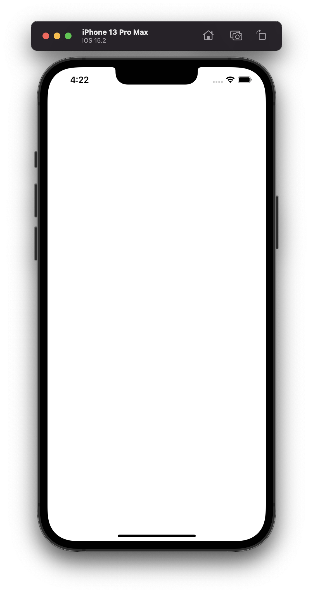


### 実機での起動

また、AppleIDとpasswordをお持ちの方は実機でテストすることもできます。  
1.General > SigningのTeamで自分のアカウントを設定する  
2.ツールバーからDeviceを接続している端末に設定し、build  
3.設定 > 一般 > プロファイルとデバイスの管理から、デベロッパAPPで自分のアカウントを信頼する。  

アプリの起動を確認できたので、ここからアプリに様々な変更を加えていきたいと思います。  

<!-- Annotations -->
[^1]:開発に必要なツールがひとまとめになったソフトウェア

## 開発手順

iOSアプリは基本的に以下の手順を繰り返して作り込んでいきます。  

#### UIの作成(パーツの配置) → 配置したUIパーツとユーザー(アプリ利用者)のアクションに対して処理を紐づける → 紐づけた処理を実装する(コーディング)

まずは簡単なUIパーツを配置して、アプリを動かしてみましょう。  

## ラベル(文字)

#### 1. Main.storyboardを開く

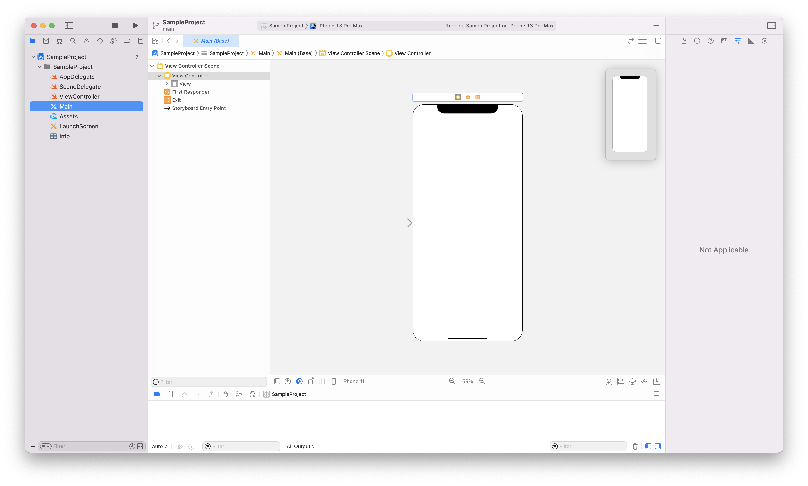

Main.storyboardはアプリの画面を設定するファイルです。  
ここに表示されているiPhoneの画面に対してパーツを配置していきます。  

#### 2. Labelを配置する

ツールバーの+ボタンを押してメニューを表示し、Labelをドラッグアンドドロップで画面に配置します。  

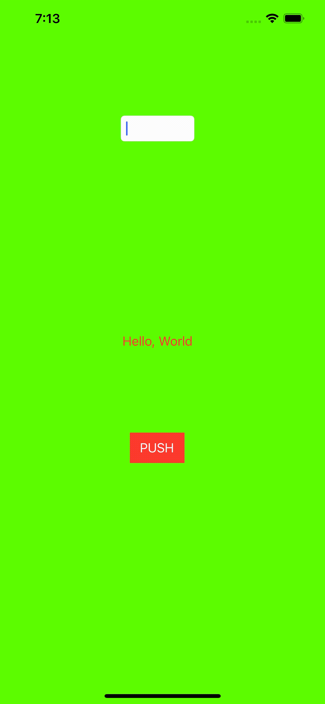

#### 3. 文字を編集する

デフォルトでは「Label」の文字が入っているため、ここに任意の文字を入力してみます。  

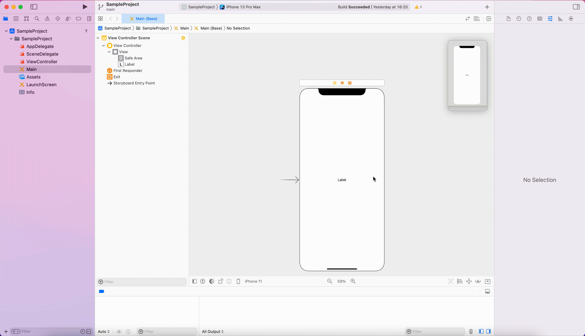

#### 4. 実行

この状態でアプリを起動してみましょう先ほど入力した文字が表示されるはずです。  
※現時点では端末によって配置した場所からずれて表示される場合があります。  

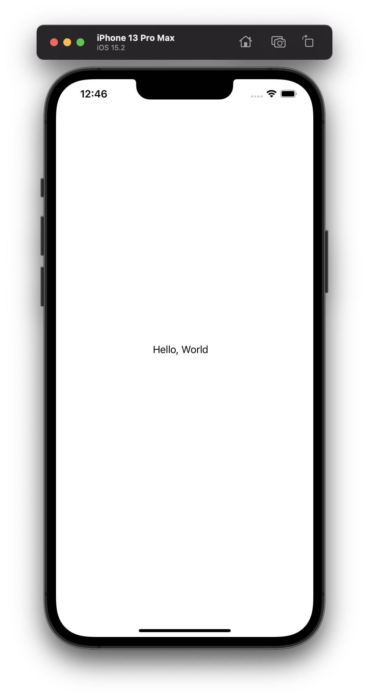

#### 5. 色を変更する

右側のユーティリティエリアから画面や配置したパーツの設定をいじることができます。背景色や文字色を変化させてみましょう。  
背景色 → 「View」を選択し、ユーティリティエリアから「Background」を変更します。  
文字色 → 「Label」を選択し、ユーティリティエリアから「Color」を変更します。  


## ボタン

#### 1. Buttonを配置する

ツールバーのLibraryボタンを押してメニューを表示し、Buttonをドラッグアンドドロップで画面に配置します。  

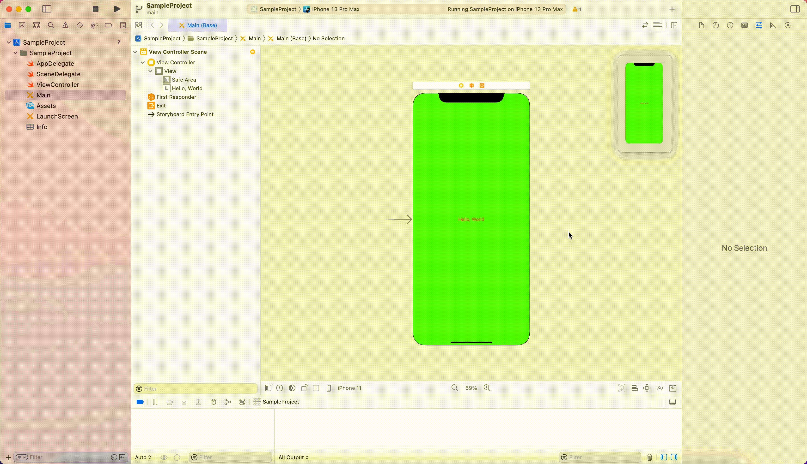

配置が終わったら、Labelと同じ様にユーティリティエリアからTitle, Text Color, Background Colorなどを変更して見た目を整えてください  

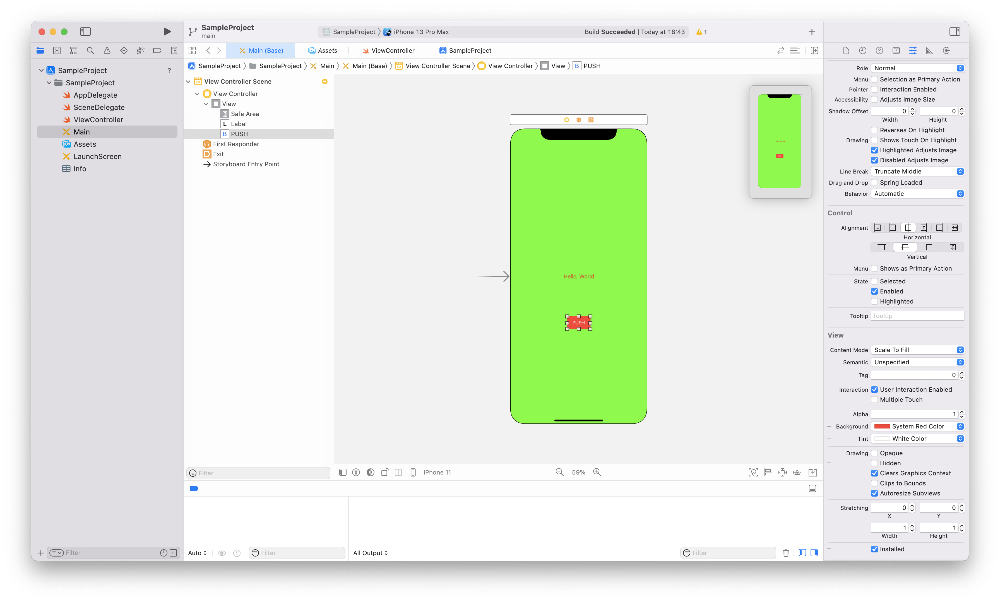

#### 2. ボタンを押した時の処理を実装する

ボタンを配置できたので、このボタンを押した時、Labelの文字を変更する処理を実装してみましょう。(プログラミング)  
実装手順はいくつも考えられますが、今回は以下の手順で作っていきます。  

1. 画面に紐づくソースコードを開く
2. 変更対象のラベルをソースコードに紐づける
3. <u>「ボタンを押して離す」</u>というアクションをソースコードに紐づける
4. ソースコードに紐づけたラベルのTextにアクセスして、文字を変更する処理を記述する。
5. 実行してみて動作を確認する。

#### ソースコードの表示

まず、画面に紐づくソースコードを表示してみます。  
以下のように画面上部のハンバーガーメニューから「Assistant」を選択することで、ソースコードを表示することが可能です。  
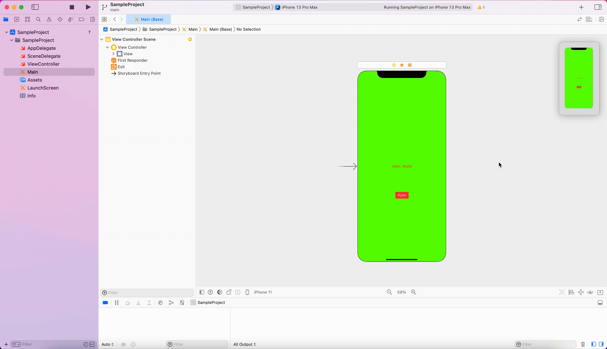


※ ここで開いたソースコードはナビゲーションエリアに表示されている「ViewController.swift」です。  

#### ラベルの紐づけ

Main.storyboard上のLabelをctrlキーを押しながらクリックし、ソースコードに向かって引っ張ります。  
メニューが表示されるので、ソースコード上でこのラベルを扱うための名前を入力すると、ソースコード上に一行追加されます。  
●がつけば紐づけ完了です。  

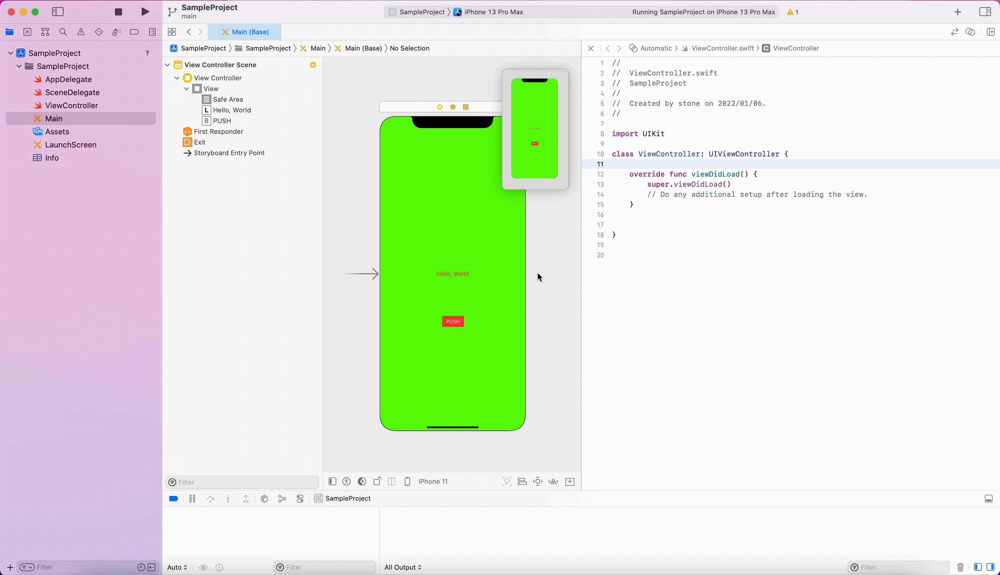

#### アクションの紐づけ

Main.storyboard上のButtonをctrlキーを押しながらクリックすると、そのボタンに対するアクションの一覧が表示されます。  
この一覧の中の「Touch Up Inside」(UIパーツの上で指を離すアクション)の○マークをクリックし、ソースコードに向かって引っ張ります。  
●がつけば紐づけ完了です。  

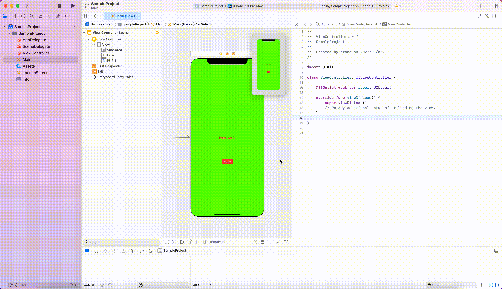

#### 処理の記述

最後にラベルの文字列を変更する処理を記述します。  
アクションに紐づけた部分の{}の間に以下の様な記述を加えてください。  

```swift
@IBAction func onPushButton(_ sender: Any) {
  label.text = "Goodbye"
}
```

これは**代入**と呼ばれる処理になります。  
ボタンが押された時にラベルのテキスト(表示する文字)に対して"Goodbye"という文字列を代入しています。  

#### 3. 実行

ここまでできたら実際に動かして確認してみましょう。ボタンを押した時にLabelの文字が変化するはずです。  

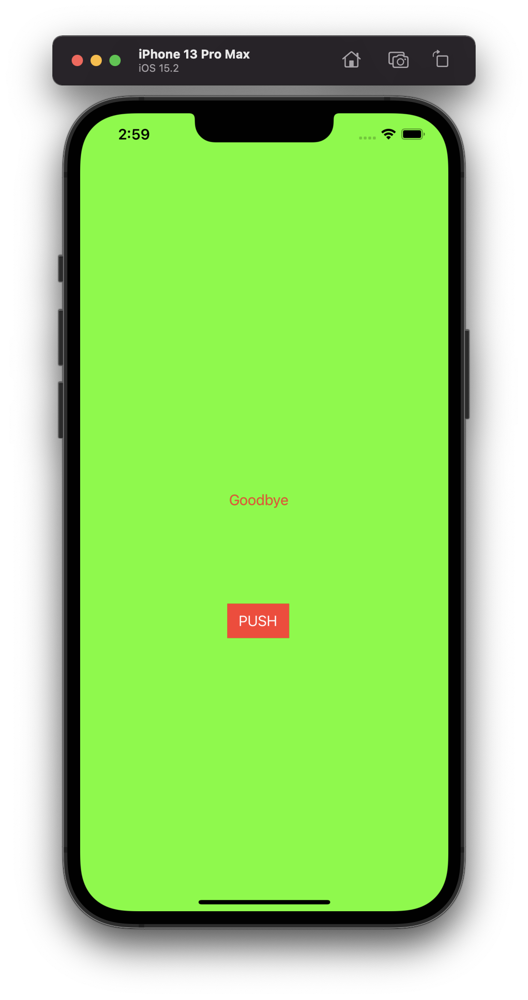

## テキストボックス

次にテキストボックスを使ってユーザーから入力された文字列をラベルに設定する処理を実装してみましょう。  

#### 1.TextFieldを配置する

ツールバーのLibraryボタンを押してメニューを表示し、Text Fieldをドラッグアンドドロップで画面に配置します。  

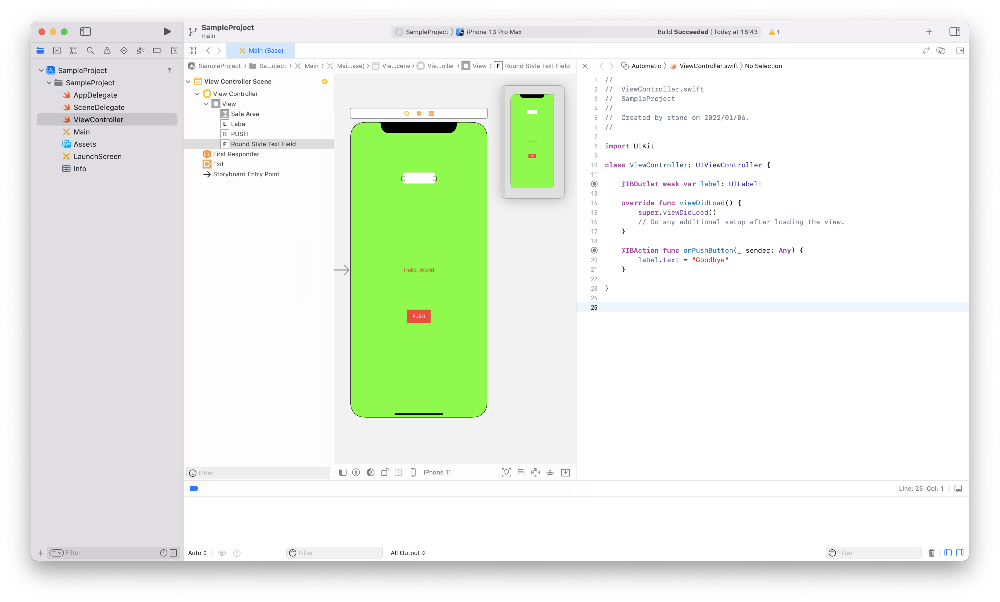

#### 2.テキストボックスの紐づけ

ラベルの時と同様に、Main.storyboard上のText Fieldをctrlキーを押しながらクリックし、ソースコードに向かって引っ張って紐付けを行います。  

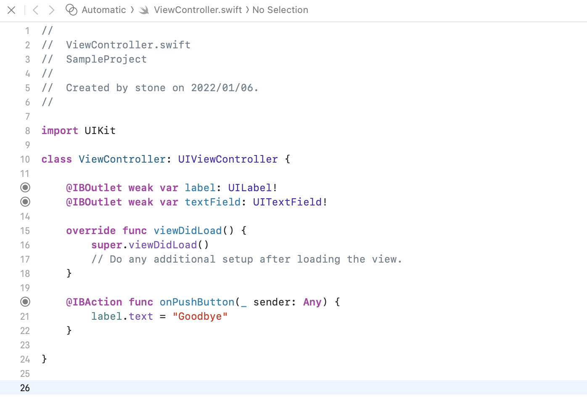

#### 3.処理の記述

先ほどボタンを押した時の処理を記述した部分を、テキストボックスの値を設定するように修正します。  

```swift
@IBAction func onPushButton(_ sender: Any) {
  label.text = textField.text
}
```

#### 4. 実行

[次へ](./02-計算機アプリの作成.md)  